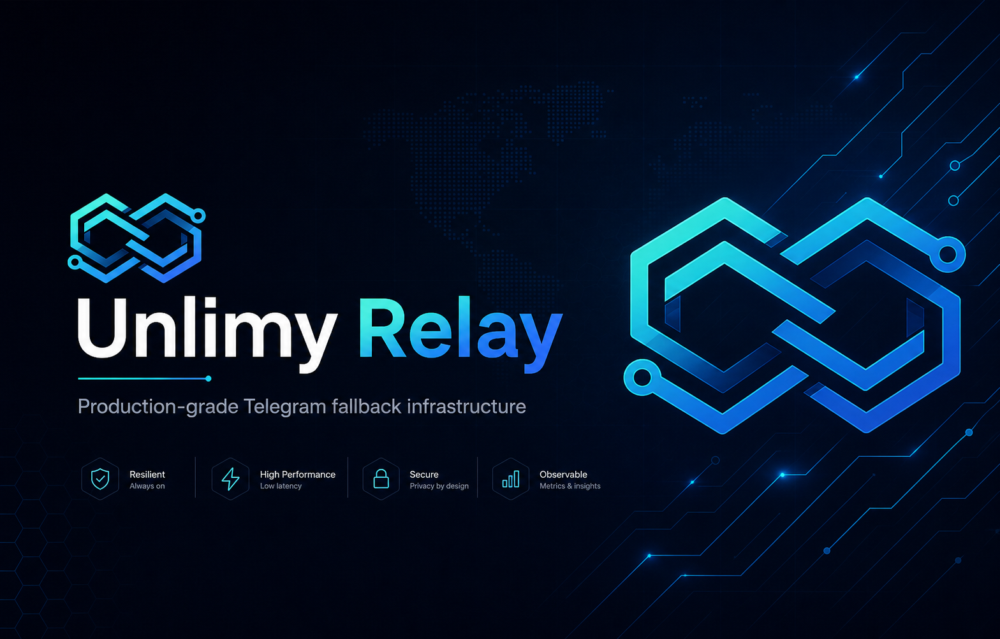

# Unlimy Relay




Unlimy Relay is a production-grade Telegram fallback platform for operating resilient proxy infrastructure at scale.

It combines a secure control plane, operator-focused automation, and user-facing delivery into one system that is fast to deploy, easy to operate, and hard to break.

## Why This Project

Most proxy setups fail in real operations, not in demos:
- no lifecycle controls,
- weak observability,
- manual incident handling,
- poor security boundaries,
- no operator UX.

Unlimy Relay solves this with an opinionated architecture built for real infrastructure teams.

## Core Capabilities

- Node lifecycle management: create, update, enable/disable, check, rotate, restart, delete
- Public proxy delivery: random healthy proxy + QR generation
- Admin control surface: JWT + RBAC + TOTP protected routes and UI
- Operational automation: health checks, scheduled tasks, rotation jobs
- Security boundaries: authenticated admin API, public-safe proxy endpoints only
- Auditability: action logs for critical operations
- Anti-abuse: request rate limiting + response cooldown/cache on public proxy issuance
- Dashboard observability: KPIs, problem nodes, recent alerts/audit, 24h trends

## Architecture

- `master-api` (FastAPI)
  - `/api/v1` control and data plane
  - auth, RBAC, audit, node orchestration, proxy issuance
- `web` (Next.js)
  - public route: `/config`
  - admin routes: `/admin/*`
- `worker` + `beat` (Celery)
  - periodic health/rotation and background jobs
- `postgres` + `redis`
  - state + queue/backing services
- `prometheus` + `grafana`
  - metrics and dashboards
- `bot-service`
  - optional Telegram automation/webhook integration

## Security Model

- Authentication: JWT tokens
- Second factor: TOTP for admin login
- Authorization: role-based access (`viewer`, `operator`, `admin`)
- Public boundary: only safe proxy endpoints exposed publicly
- Admin boundary: node/jobs/audit/alerts endpoints require valid token
- Infrastructure hardening ready: fail2ban, firewall policy, DNS-over-TLS, kernel/network tuning

## Public vs Admin Routing

Single-domain path split is supported and recommended:
- Public UX: `/config`
- Admin UX: `/admin/login`, `/admin`, `/admin/nodes`, `/admin/alerts`, `/admin/audit`

This keeps onboarding simple for users while preserving operational isolation.

## API Highlights

Public:
- `GET /api/v1/proxy/random`
- `GET /api/v1/proxy/random/qr`
- `GET /api/v1/proxy/public-status`

Admin (auth required):
- `POST /api/v1/auth/token`
- `GET /api/v1/nodes`
- `PATCH /api/v1/nodes/{id}`
- `POST /api/v1/nodes/{id}/check|rotate|restart|enable|disable`
- `POST /api/v1/jobs/health/run`
- `POST /api/v1/jobs/rotation/run`
- `GET /api/v1/admin/overview`
- `GET /api/v1/alerts`
- `GET /api/v1/audit`

## Quick Start (Dev)

1. Create env file:
```bash
cp .env.example .env
```

2. Set required values in `.env`:
- `JWT_SECRET`
- `ADMIN_USER`, `ADMIN_PASSWORD`, `ADMIN_TOTP_SECRET`
- `TELEGRAM_BOT_TOKEN` (optional, if bot is enabled)

3. Start stack:
```bash
docker compose up -d --build
```

## Production Start

```bash
docker compose -p relay -f docker-compose.prod.yml up -d --build
```

## Default Service Ports (prod compose)

- Web: `13000`
- API: `18080`
- Bot service: `18090`
- Prometheus: `19090`
- Grafana: `13001`

## Operational Principles

- Prefer explicit audit trails for admin actions
- Keep public payloads minimal and safe
- Fail safely: degrade gracefully when healthy nodes are low
- Optimize for operator speed without exposing internal secrets
- Ship in small PRs with clear ownership and conflict-resistant scope

## Roadmap Direction

- richer node metadata and quality scoring
- stronger policy engine for routing/selection
- advanced anti-abuse (adaptive heuristics)
- admin UX depth comparable to top-tier relay panels
- full secret encryption lifecycle (KMS/Vault-backed)

## Quality Standard

This project is built with production posture first:
- security-aware defaults,
- operational clarity,
- real-world automation,
- strict separation of public and admin concerns.

If you are building serious Telegram fallback infrastructure, this is the right foundation.


